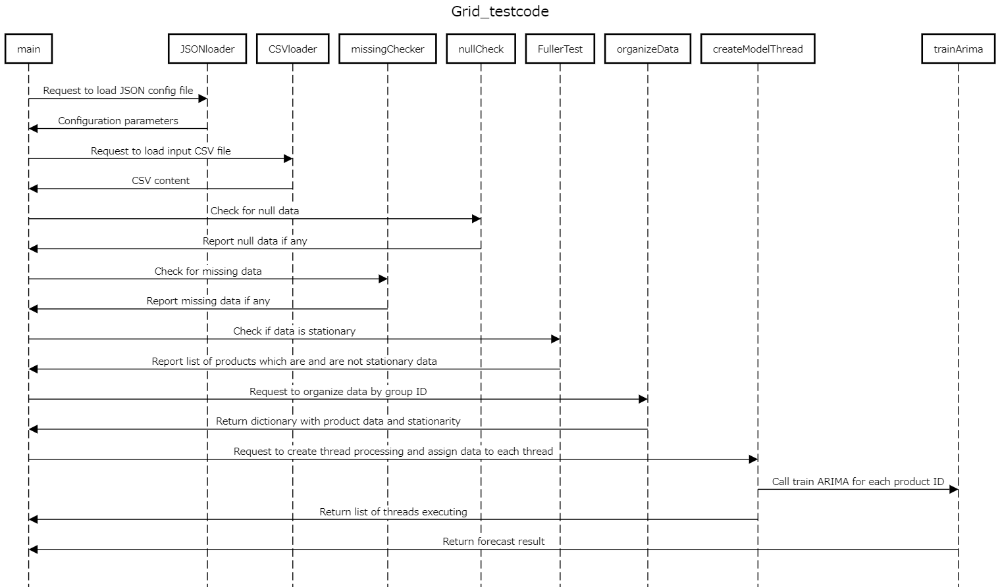

# Grid_testcode #
## Description ##

Develop prediction model for sales based on past sales and discount record.

## Test environment ##
Execution of code done on Python 3.10.0

## Usage ##
The user must insert the following data before running in "config.json":

Variable name | Description | Data type
---|---|---|
Number_of_processing_thread | Define the number of threads to create and split the train calculation | int
Sales_data | Define the sales data location | str
Sales_data_start | Defines the data starting date (Year,month) | int
Sales_data_end | Defines the data ending date (Year,month) | int
Sales_forecast | Define the sales forecast data location | str
Sales_forecast_start | Defines the data starting date (Year,month) | int
Sales_forecast_end | Defines the data ending date (Year,month) | int
Discount_data | Define the discount data location | str
Discount_data_start | Defines the data starting date (Year,month) | int
Discount_data_end | Defines the data ending date (Year,month) | int
Discount_forecast | Define the discount forecast data location | str
Discount_forecast_start | Defines the data starting date (Year,month) | int
Discount_forecast_end | Defines the data ending date (Year,month) | int

After executing main.py, user must confirm if missing data and null data is relevant to be taken action. (In this example, missing data were found at the start of recorded data thus no action were required)

To continue the missing and null data check press "y" key followed by enter.

The software contains stationary test function included, however it is not used as input because the content is handled ARIMA function. - This function were used only during development for data observation.

## OPL - Open point list ##
Find the know open point list below:
OPL - ID | Description 
---|---|
1| Code were not completely refactored related to function description inside the code
2| Prediction for products were generated however some predictions had negative values and some high deviations - because of time limitation, improving the forecast model for each different product ID were not done
3| Threading were added to try to reduce processing time calculation, however concrete improvement on processing time must be measured to confirm its benefit
4| Requeriment list were created considered only a simple check list table instead a system level based requeriment list.

## SW sequence diagram ##

